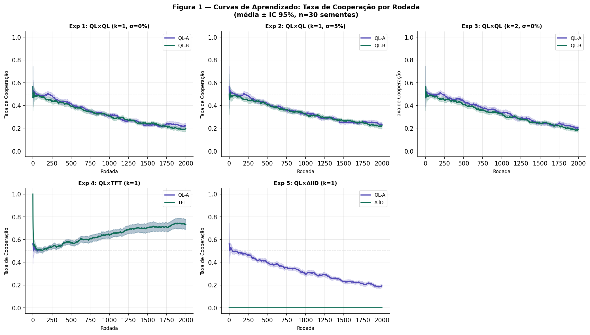
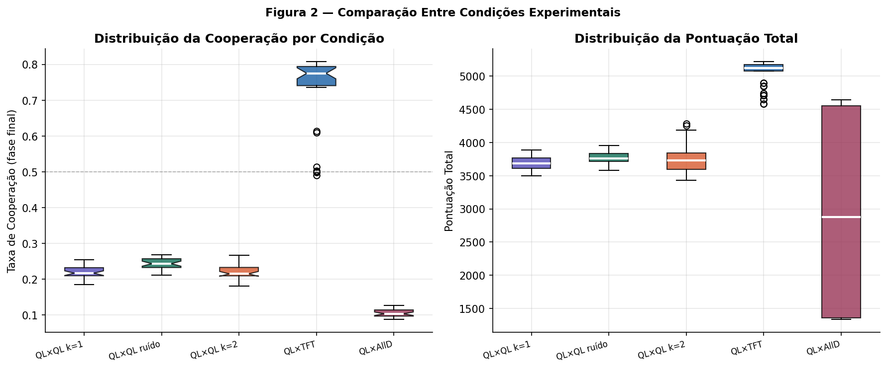
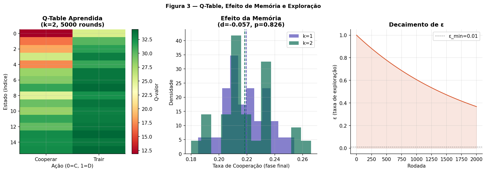
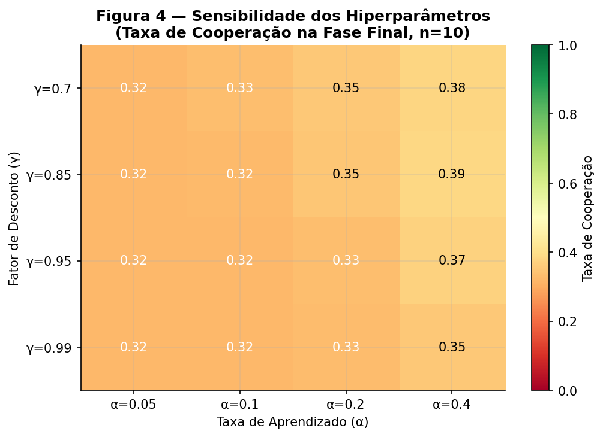

# 🎮 Aprendizado por Reforço no Dilema do Prisioneiro Iterado


## 📌 Introdução

Estudo computacional completo sobre a **emergência de comportamento cooperativo** em agentes dotados de Q-Learning tabular que interagem no **Dilema do Prisioneiro Iterado (DPI)**.

Cinco experimentos fatoriais (n=30 sementes, T=2.000 rodadas cada), variando tipo de oponente, nível de ruído e profundidade de memória. Os resultados são analisados com testes estatísticos inferenciais (Kruskal-Wallis, Mann-Whitney + Bonferroni, d de Cohen) e documentados em artigo científico completo.

## 🔑 Resultados principais

| Condição | Taxa de Cooperação | Interpretação |
|---|---|---|
| QL × QL (k=1, σ=0%) | 21.9% | Convergência para equilíbrio de Nash (D,D) |
| QL × QL (k=1, σ=5%) | 24.4% | Ruído quebra ciclos de traição |
| QL × QL (k=2, σ=0%) | ~22% | Memória adicional sem efeito (d=-0.057) |
| **QL × TFT** | **72.4%** | **Cooperação emerge com oponente recíproco** |
| QL × AllD | 10.5% | Agente aprende a trair contra ambiente hostil |

**Análise estatística:** Kruskal-Wallis H=125.12 (p<0.001) — diferença significativa entre condições. O tipo de oponente é o principal determinante da cooperação (r=1.0, efeito máximo).

## 📊 Visualizações

| Curvas de Aprendizado | Comparação entre Condições |
|---|---|
|  |  |

| Q-Table e Efeito de Memória | Sensibilidade de Hiperparâmetros |
|---|---|
|  |  |

## 🧠 Design Experimental

```
Experimento 1 → QL × QL  (k=1, σ=0%)  — baseline
Experimento 2 → QL × QL  (k=1, σ=5%)  — ruído implementacional
Experimento 3 → QL × QL  (k=2, σ=0%)  — efeito de memória
Experimento 4 → QL × TFT (k=1, σ=0%)  — oponente recíproco
Experimento 5 → QL × AllD(k=1, σ=0%)  — oponente hostil
```

**n=30 sementes · T=2.000 rodadas · análise não-paramétrica**

## 🏗️ Arquitetura do Agente Q-Learning

```
Estado  : últimas k ações (my, opp) → |S| = 4^k estados
Ação    : Cooperar (C) ou Trair (D)
Update  : Q(s,a) ← Q(s,a) + α[r + γ·max Q(s',·) − Q(s,a)]
Política: ε-greedy com decaimento exponencial

Hiperparâmetros: α=0.1 · γ=0.95 · ε₀=1.0 · decay=0.9995 · ε_min=0.01
```

## 📄 Artigo científico

O projeto inclui um artigo completo (`paper/`) com:
- Fundamentos de Teoria dos Jogos e Q-Learning
- Metodologia experimental detalhada
- Análise estatística inferencial completa
- Discussão teórica conectando folk theorem, torneio de Axelrod e MARL
- Referências canônicas (Axelrod 1984, Watkins 1992, Sandholm & Crites 1996)

## 🛠️ Stack

- **Simulação:** NumPy, Python puro (sem frameworks de RL)
- **Análise:** pandas, SciPy (Kruskal-Wallis, Mann-Whitney)
- **Visualização:** matplotlib, seaborn
- **Ambiente:** Google Colab / Jupyter

## ▶️ Como executar

```bash
pip install numpy pandas scipy matplotlib seaborn
```

Execute o notebook: `notebooks/IPD_MARL_Notebook.ipynb`

Não requer dataset externo — todo o ambiente é simulado no próprio notebook.

## 🔗 Projetos relacionados

- [Inferência Bayesiana Aplicada — A/B Testing](https://github.com/gilsonmm6/bayesian-ab-marketing)
- [Análise de Fairness — COMPAS](https://github.com/gilsonmm6/compas-fairness-analysis)
- [Previsão TSLA com LSTM](https://github.com/gilsonmm6/tesla-lstm-forecast)

## 👤 Autor

**Gilson Machado Monteiro**  
Data Analyst & BI Analyst | Especialização em Estatística Aplicada (PUC Minas)  
[LinkedIn](https://linkedin.com/in/gilsonmachadomonteiro) · [GitHub](https://github.com/gilsonmm6)
